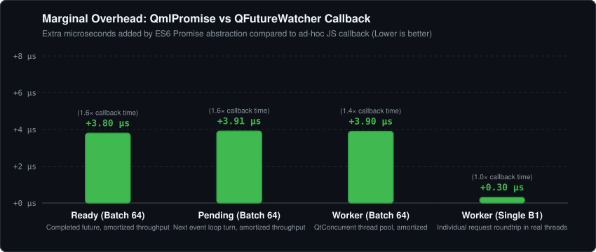
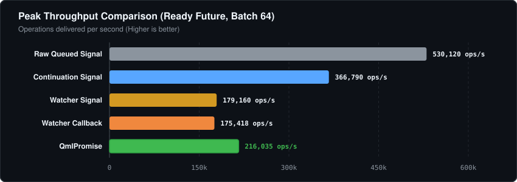

# C++ to QML asynchronous result benchmark

This standalone benchmark measures the existing QmlPromise header without modifying it.
It uses actual QML code in a QQmlEngine and runs without a display server.

## Reproduce

From the repository root:

```sh
cmake -S benchmarks -B /tmp/qmlpromise-benchmark -G Ninja -DCMAKE_BUILD_TYPE=Release
cmake --build /tmp/qmlpromise-benchmark
/tmp/qmlpromise-benchmark/bench_qml_promise > benchmarks/results.csv
/tmp/qmlpromise-benchmark/bench_qml_promise --micro > benchmarks/components.csv
python3 benchmarks/summarize.py
python3 benchmarks/generate_charts.py
```

`generate_charts.py` regenerates the standalone SVG vector graphics in `charts/` that are embedded directly in the repository documentation.

`results.csv` and `components.csv` contain the latest measurements with explicit polyfill
installation. `*-cached-auto.csv` preserves the intermediate cached implementation that
still checked for the polyfill during conversion. The corresponding
`*-before.csv` files preserve the original measurements from the preceding run with the
header at commit `9054f526d7d3de2cff136e0bc75ca917f3b2b74a`.
These files contain recorded measurements, not performance thresholds. Benchmark workloads
and timing methodology are unchanged; installer calls were renamed with the public API.

## Methods

All methods start with QML calling a C++ invokable and end in the same QML result handler:

- `queued_signal`: queue an invocation to the backend's thread, emit a signal connected
  to the QML handler. No future observer or JavaScript promise. In the worker workload,
  a QtConcurrent job queues this delivery.
- `watcher_signal`: create a QFutureWatcher per request and emit the result signal on completion.
- `watcher_callback`: create a QFutureWatcher per request and call a QJSValue callback on completion.
- `continuation_signal`: use QFuture::then(context, ...) to emit the result signal.
- `qmlpromise`: use QmlPromise::fromFuture and attach the QML handler with .then().

Three workloads isolate different costs:

- `ready`: a completed integer future. The queued-signal baseline simply queues its integer.
- `pending`: a QPromise completed on the next event-loop turn. The baseline is the same
  queued signal as in `ready`, so it avoids promise/future allocation and watcher events.
- `worker`: a QtConcurrent job on a dedicated four-thread pool returns an integer.
  This includes scheduling but intentionally performs no expensive computation or sleep.

Batch 1 measures one request at a time. Batch 64 measures throughput by submitting up to
64 requests before draining the event loop. A ready continuation may execute synchronously;
it is not forced to match native Promise asynchronous semantics. These approaches also
have different cancellation, error, composition, and lifetime semantics. The alternatives
implement only successful result delivery, not all QmlPromise behavior.

Each scenario has a warm-up sample and seven recorded samples. Each recorded sample
contains 256 operations for batch 1 or 2,048 for batch 64. Method order is shuffled with
a fixed seed. QML validates the count, sum, and absence of duplicate values for every batch.

`setup_us_per_op` measures the QML submission call: invocations, future creation/scheduling,
observer or promise setup, and handler attachment. Synchronously executed continuations
also deliver their result during this interval.

`total_us_per_op` measures elapsed time divided by operations, including submission,
event-loop pumping, QML handling/validation, deferred deletion, waiting for workers to
return, and a final garbage collection. Natural automatic GC is also included. An initial
GC occurs outside the timed sample. Batch 64 totals are **amortized elapsed time**, not
individual request latency. Batch 1 includes harness/event-loop overhead; neither metric
is an isolated CPU-cycle measurement of the library. No GUI rendering is involved.

`--micro` separately compares an explicit idempotent installer call, the current resolver
factory (which no longer checks the polyfill), and a small equivalent resolver factory evaluated
once and called repeatedly. It drains events every 64 operations and reports loop time
and time including final GC. This cached function is a diagnostic experiment, not a
replacement library implementation. These standalone C++ calls have a different execution
context from QML-initiated requests; their costs must not be added to or subtracted from
the end-to-end benchmark. First-use engine startup and cold polyfill installation are excluded.

## Recorded environment and results

Measured on 2026-10-04: AMD Ryzen 7 3800X, Linux x86-64, Qt 6.11.2,
GCC 16.2.1, CMake Release build. CPU frequency and affinity were not locked.
Results describe this machine and Qt version, not a guarantee for other platforms.

### Comparison: QmlPromise vs Baseline Async Mechanisms






Median elapsed microseconds per operation, including event-loop pumping and cleanup:

| Method | Ready, batch 64 | Pending, batch 64 | Worker, batch 64 | Worker, batch 1 |
|---|---:|---:|---:|---:|
| Queued signal (Raw baseline) | 1.92 | 1.94 | 4.58 | 11.84 |
| Future continuation → signal | 2.73 | 3.93 | 7.36 | 15.61 |
| Future watcher → signal | 5.87 | 6.91 | 9.91 | 18.82 |
| Future watcher → JS callback | 6.01 | 7.04 | 10.06 | 18.56 |
| **QmlPromise → .then()** | **9.81** | **10.96** | **13.96** | **18.87** |

#### Marginal Overhead Analysis

Comparing `QmlPromise` to `Future watcher → JS callback` (the closest callback-style equivalent):

- **Ready, batch 64**: +3.80 µs (1.6× total time)
- **Pending, batch 64**: +3.92 µs (1.6× total time)
- **Worker, batch 64**: +3.90 µs (1.4× total time)
- **Worker, batch 1**: +0.31 µs (1.0× total time — virtually identical in real thread execution)

The Promise abstraction introduces only **~3.8–3.9 µs/op** of overhead over an ad-hoc watcher callback. In return, QML code gains:
- Standard ECMAScript `.then()`, `.catch()`, `.finally()` promise chaining.
- Multi-future composition via `Promise.all([p1, p2, ...])` and `Promise.race(...)`.
- Automatic C++ `std::exception` translation to Promise rejection without writing error signal boilerplate.
- Elimination of stateful `QFutureWatcher` object lifecycle management.

For single-request worker jobs (`Worker, batch 1`), the 18.87 µs turnaround is practically indistinguishable from the 18.56 µs callback baseline (+0.31 µs), and consumes less than **0.12%** of a single 60 FPS frame (16.6 ms).

All 24 automated unit tests passed, including tests for garbage collection resilience, engine isolation, and explicit polyfill installation.

## Qt documentation consulted through Qt Docs MCP

- [QFuture::then(QObject *, ...)](https://doc.qt.io/qt-6/qfuture.html#then-1)
  documents context-thread dispatch and immediate handling of ready futures.
- [QFutureWatcher::setFuture](https://doc.qt.io/qt-6/qfuturewatcher.html#setFuture)
  documents delivery of existing future state and connecting before observation.
- [QJSEngine::evaluate](https://doc.qt.io/qt-6/qjsengine.html#evaluate)
  documents evaluation of source strings in the engine.
- [QML signal handling](https://doc.qt.io/qt-6/qtqml-syntax-signals.html)
  documents connecting signals to JavaScript handlers.
